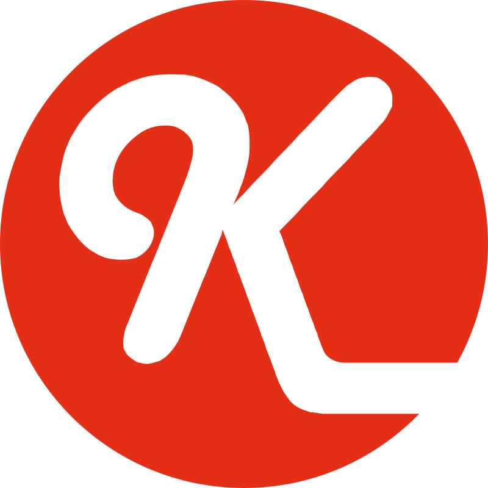
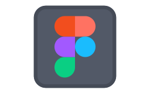

## 👩‍💻 About me
- 🌍 &nbsp; I’m from **Spain**.
- 💻 &nbsp; I’m currently working as a junior consultant at **Avanttic Consultoría Tecnológica S.L.**
- 🌱 &nbsp; I’m currently learning **OSB** and **BPEL**.
- 👩‍💻 &nbsp; All of my projects are available on [Github](https://github.com/lauritajavega99?tab=repositories).
- 🎨 &nbsp; You can also take a look at [my portfolio](https://lauritajavega99.github.io/portfolio.html).
- 📝 &nbsp; Checkout my [resume](https://drive.google.com/file/d/1_AXhXcmJ3b8Zhf1vN4XsmHQT1oEsOwOf/view?usp=sharing).

## 🛠 Languages and Tools
**Programming languages 💻**
   

 **Web / mobile development 📱**
      

 **Frameworks 💡**
       

 **IDEs 🛠**
    

 **Databases 📚**
  

 **Others ⚙**
     

 **Design 🖌**
  &nbsp;  &nbsp;  &nbsp;   

## 📊 Github Stats
  

## 🔎 Connect with me
 
 
 

